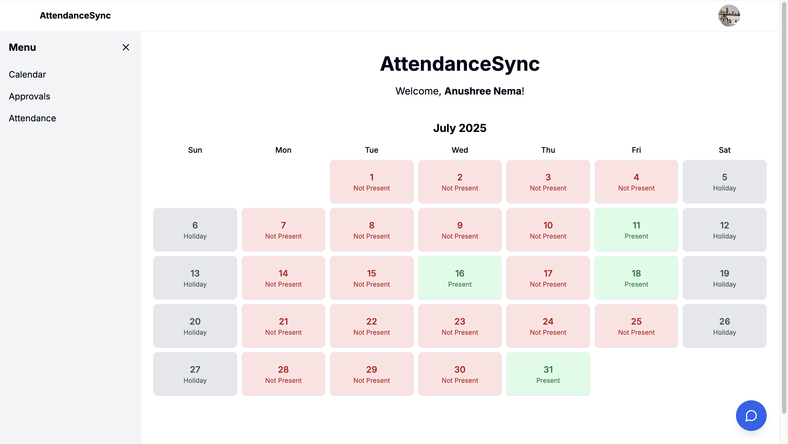
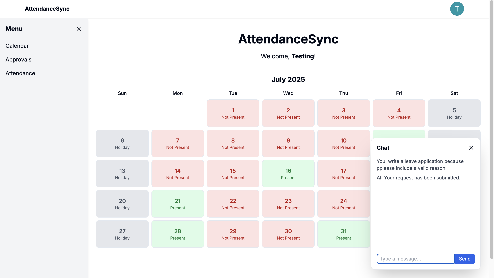
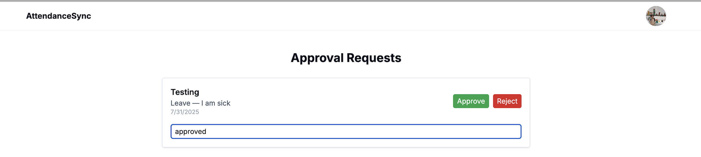
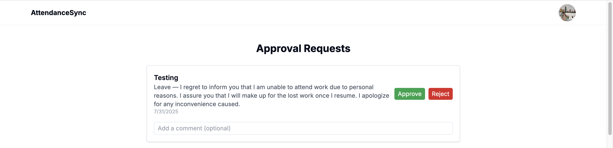
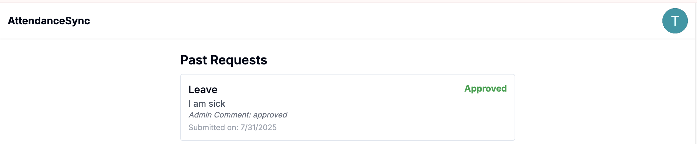

# 🧠 AttendanceSync

A full-stack HR portal for managing employee attendance, automating leave request generation using OpenAI, and streamlining admin approvals with a modern, responsive UI.

---

## 🚀 Features

- ✅ **User Dashboard** for logging attendance, viewing history
- ✉️ **Auto-generated leave requests** using OpenAI (based on attendance patterns)
- 🔒 **Role-based access** for Employees and Admins
- 🧾 **Admin Panel** to review, approve, or reject leave requests
- 📊 **Attendance summary and tracking** per user

---

## 🛠️ Tech Stack

- **Frontend:** Next.js, React, TypeScript, Tailwind CSS
- **Backend:** Node.js, Next.js
- **AI Integration:** OpenAI GPT API
- **Database:** PostgreSQL
- **Auth:** NextAuth

---

## 📸 Screenshots

### 🔹 User Attendance Dashboard

### 🔹 Auto-Generated Leave Request (GPT)

### 🔹 Admin Approval Panel

### 🔹 User Approval Requests Panel

---

## 🧠 How OpenAI is Used

We use OpenAI's GPT API to:

- Draft human-like leave requests
- Pre-fill reasons, dates, and justification for approval

---
